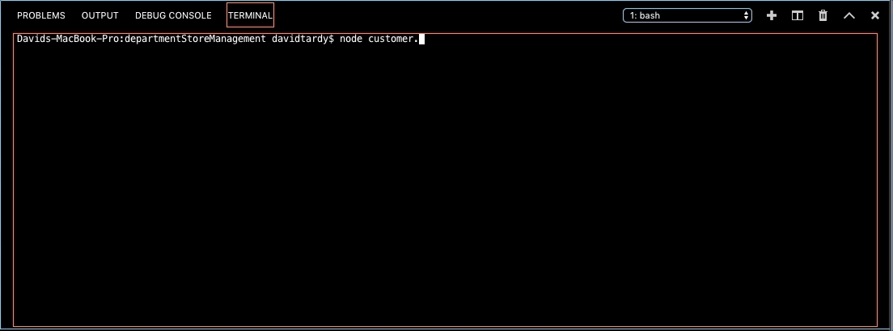
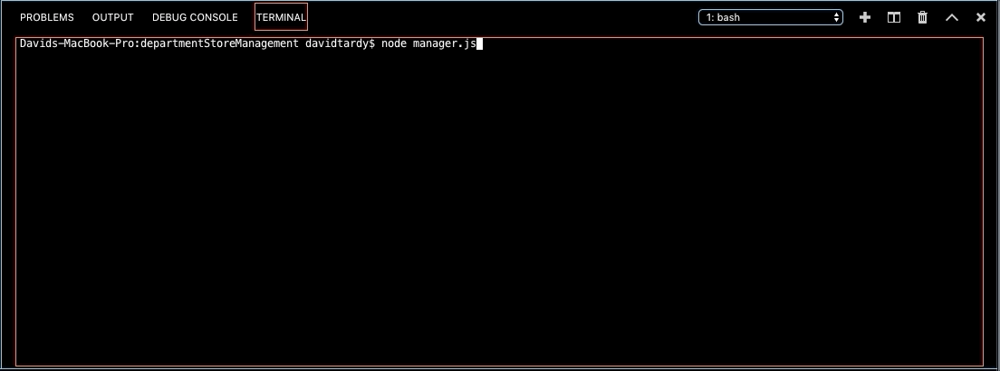
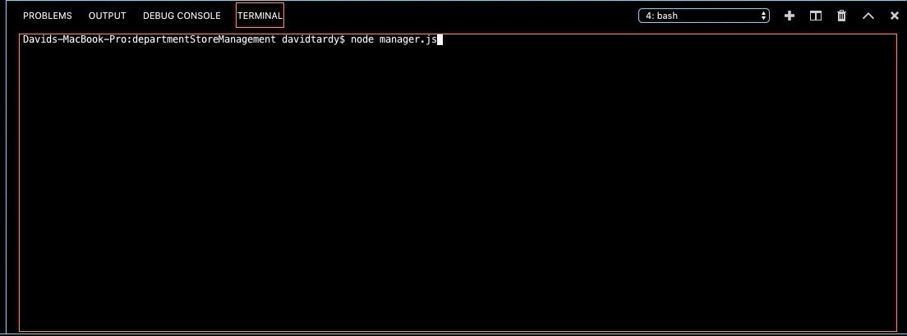

# departmentStoreManagement
3 CLI Apps for customer purchases and 2 levels of management.

## customer.js

* Running this application will first display all of the items available for sale. Include the ids, names, and prices of products for sale.
* The app should then prompt users with two messages.
    * The first should ask them the ID of the product they would like to buy.
    * The second message should ask how many units of the product they would like to buy.
* Once the customer has placed the order, your application should check if your store has enough of the product to meet the customer's request.

## manager.js

* If a manager selects View Products for Sale, the app should list every available item: the item IDs, names, prices, and quantities.
* If a manager selects View Low Inventory, then it should list all items with an inventory count lower than five.
* If a manager selects Add to Inventory, your app should display a prompt that will let the manager "add more" of any item currently in the store.
* If a manager selects Add New Product, it should allow the manager to add a completely new product to the store.

### View Products

### View Low Inventory

### Add To Inventory

### Add Product

## supervisor.js

* When a supervisor selects View Product Sales by Department, the app should display a summarized table in their terminal/bash window.
* The total_profit column should be calculated on the fly using the difference between over_head_costs and product_sales.

